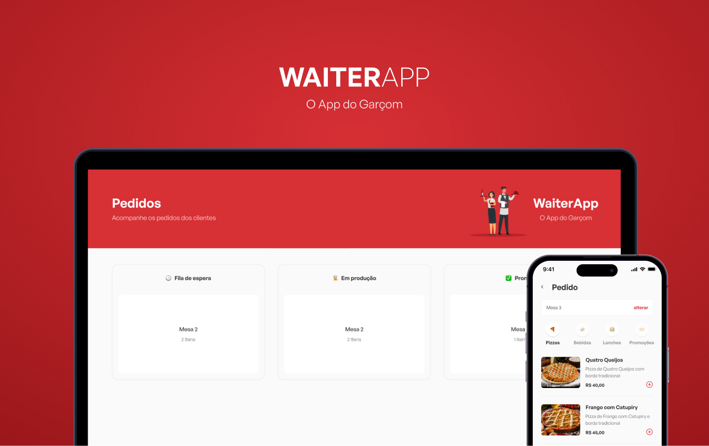

<div align='center'>
  
</div>

<div align="center">
  <image src="https://img.shields.io/badge/Node.js-43853D?style=for-the-badge&logo=node.js&logoColor=white" />
  <image src="https://img.shields.io/badge/MongoDB-4EA94B?style=for-the-badge&logo=mongodb&logoColor=white" />
  <image src="https://img.shields.io/badge/TypeScript-007ACC?style=for-the-badge&logo=typescript&logoColor=white" />
  <image src="https://img.shields.io/badge/React-20232A?style=for-the-badge&logo=react&logoColor=61DAFB" />
  <image src="https://img.shields.io/badge/React_Native-20232A?style=for-the-badge&logo=react&logoColor=61DAFB" />
</div>

# WaiterApp

O WaiterApp é uma ferramenta projetada para facilitar o trabalho de garçons, agilizando o processo de atendimento e gestão de pedidos. O objetivo do app é melhorar a eficiência dos serviços em restaurantes, bares e cafés.



## Tabela de conteúdos

- [WaiterApp](#waiterapp)
  - [Tabela de conteúdos](#tabela-de-conteúdos)
  - [Arquitetura](#arquitetura)
    - [API (Backend)](#api-backend)
    - [Dashboard Web (Frontend)](#dashboard-web-frontend)
    - [App Mobile](#app-mobile)
  - [Features](#features)
  - [Instruções de execução](#instruções-de-execução)
    - [Pré-requisitos](#pré-requisitos)
    - [Instalação e Execução](#instalação-e-execução)
  - [Tecnologias Utilizadas](#tecnologias-utilizadas)

## Arquitetura

O projeto é dividido em três partes principais:

### API (Backend)

- Desenvolvida em Node.js com TypeScript
- Estrutura organizada em:
  - Models: Category, Order e Product
  - UseCases: Gerenciamento de categorias, pedidos e produtos
  - Uploads: Armazenamento de arquivos estáticos
- Integração com MongoDB para persistência de dados
- WebSockets para comunicação em tempo real

### Dashboard Web (Frontend)

- Desenvolvido em React + TypeScript
- Componentes principais:
  - Header: Cabeçalho da aplicação
  - Orders: Listagem de pedidos
  - OrdersBoard: Quadro de gerenciamento de pedidos
  - OrderModal: Modal com detalhes do pedido
- Estilização com Styled Components
- Integração em tempo real com WebSocket

### App Mobile

- Desenvolvido em React Native + TypeScript
- Principais funcionalidades:
  - Gerenciamento de mesas
  - Catálogo de produtos por categoria
  - Carrinho de pedidos
  - Confirmação de pedidos
- Componentes:
  - Categories: Listagem de categorias
  - Menu: Cardápio de produtos
  - Cart: Carrinho de compras
  - ProductModal: Detalhes do produto
  - TableModal: Seleção de mesa

## Features

1. **Gerenciamento de Pedidos**

   - Criação e acompanhamento de pedidos
   - Categorização de produtos
   - Status em tempo real

2. **Interface Mobile para Garçons**

   - Seleção de mesa
   - Navegação por categorias
   - Carrinho de pedidos
   - Confirmação de pedidos

3. **Dashboard Web**

   - Visualização em tempo real dos pedidos
   - Gerenciamento de status
   - Modal com detalhes do pedido

4. **Comunicação Real-time**
   - Atualização instantânea de pedidos
   - Sincronização entre mobile e dashboard

## Instruções de execução

### Pré-requisitos

- Node.js
- Yarn
- MongoDB

### Instalação e Execução

1. **API (Backend)**

```bash
cd api
yarn install
yarn dev
```

2. **Dashboard Web**

```bash
cd web
yarn install
yarn dev
```

3. **App Mobile**

```bash
cd app
yarn install
yarn start
```

## Tecnologias Utilizadas

- **Backend**:

  - Node.js
  - TypeScript
  - MongoDB
  - WebSocket

- **Frontend Web**:

  - React
  - TypeScript
  - Styled Components
  - Vite

- **Mobile**:
  - React Native
  - Expo
  - TypeScript
  - Styled Components

---
